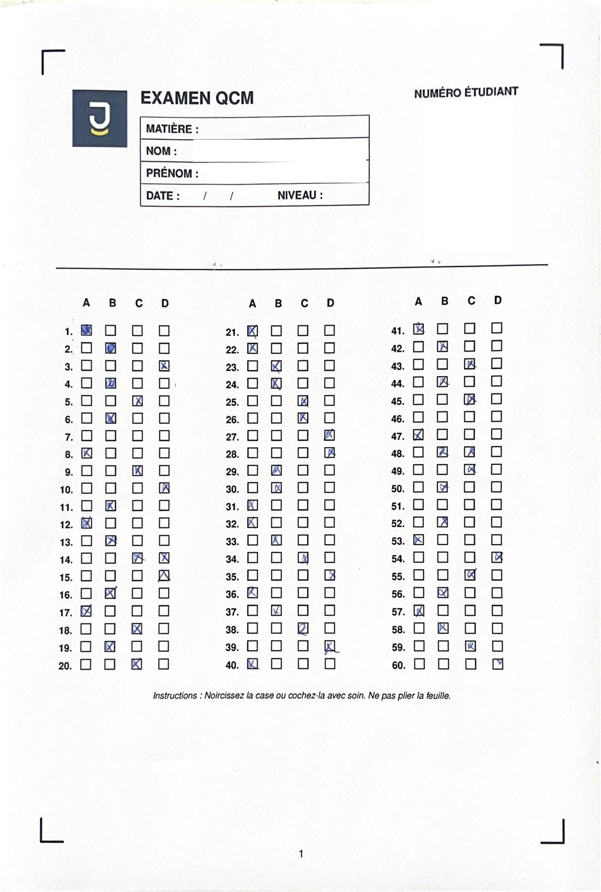

# QCM Scanner API

API de correction automatique de QCM : elle reçoit la **photo ou le scan d'une feuille de QCM** et renvoie en JSON le **nom de l'étudiant, son numéro étudiant et les réponses cochées aux 60 questions**.

Elle repose sur du traitement d'image (OpenCV), deux modèles de deep learning (TensorFlow/Keras) et de l'OCR (EasyOCR), le tout exposé via une API FastAPI.

<p align="center">
  
</p>

## Comment ça marche

1. **Redressement** : les 4 repères noirs dans les coins de la feuille sont détectés, puis l'image est redressée en perspective à une taille fixe (4504 × 6559 px).
2. **Réponses QCM** : les positions des 240 cases (60 questions × 4 choix A/B/C/D) sont lues dans `api_qcm/boxes_coords3.json`. Chaque case est classée « cochée / non cochée » par un CNN (`qcm_model2.h5`), avec un critère complémentaire sur la proportion de pixels sombres.
3. **Numéro étudiant** : les cases de la grille de chiffres sont classées par un second CNN (`qcm_model_id_augmente.h5`), puis regroupées par colonne pour reconstituer le numéro.
4. **Nom / prénom** : la zone d'identité est recadrée, nettoyée (binarisation, suppression des lignes) et lue avec EasyOCR.

## Structure du projet

```
.
├── api_qcm/
│   ├── app.py                    # Application FastAPI (routes /health et /analyze)
│   ├── service.py                # Pipeline d'analyse (vision, modèles, OCR)
│   ├── boxes_coords3.json        # Coordonnées des cases de la feuille
│   ├── qcm_model2.h5             # Modèle : case QCM cochée ou non
│   └── qcm_model_id_augmente.h5  # Modèle : cases du numéro étudiant
├── docs/                         # Contrats d'API (web, iOS/Swift)
├── examples/                     # Feuille d'exemple anonymisée
├── run_api.py                    # Point d'entrée (uvicorn)
├── launch_api.sh                 # Installe les dépendances puis lance l'API
├── requirements.txt              # Dépendances de l'API
└── requirements-dev.txt          # Dépendances des scripts d'entraînement / analyse
```

## Installation

Prérequis : **Python 3.10 à 3.12**.

```bash
git clone https://github.com/<TON_PSEUDO>/<NOM_DU_DEPOT>.git
cd <NOM_DU_DEPOT>

python -m venv .venv
source .venv/bin/activate        # Windows : .venv\Scripts\activate

pip install -r requirements.txt
```

Sous Linux (Debian/Ubuntu), OpenCV peut demander une bibliothèque système :

```bash
sudo apt update && sudo apt install -y libgl1
```

> Au premier lancement, EasyOCR télécharge ses modèles de langue (français et anglais) : une connexion internet est nécessaire.

## Lancer l'API

```bash
python run_api.py
```

L'API écoute par défaut sur `http://0.0.0.0:8000`. Pour changer le port :

```bash
PORT=5000 python run_api.py      # Windows (PowerShell) : $env:PORT=5000; python run_api.py
```

La documentation interactive générée par FastAPI est disponible sur `http://127.0.0.1:8000/docs`.

## Utilisation

```bash
curl -X POST "http://127.0.0.1:8000/analyze" \
  -F "file=@examples/example_sheet_anonymized.jpg"
```

Réponse (extrait) :

```json
{
  "nom_complet": "Prenom Nom",
  "id": "123456",
  "q1": "A",
  "q2": "",
  "q3": "BC",
  "...": "...",
  "q60": "D"
}
```

- `q1` à `q60` sont toujours présents.
- Aucune case cochée : `""` — une case : `"A"` — plusieurs cases : `"BC"`, `"ABD"`…
- Un chiffre non reconnu dans le numéro étudiant est remplacé par `?`.

En cas d'erreur, la réponse a la forme `{"error": {"code": "...", "message": "..."}}` avec un code HTTP 400, 422 ou 500.

| Route | Rôle |
|---|---|
| `GET /health` | Vérifie que l'API répond |
| `POST /analyze` | Analyse une feuille (champ `multipart/form-data` nommé `file`) |

Contrats détaillés : [`docs/API_QCM.md`](docs/API_QCM.md), [`docs/API_CONTRAT_WEB.md`](docs/API_CONTRAT_WEB.md), [`docs/API_CONTRAT_IOS_SWIFT.md`](docs/API_CONTRAT_IOS_SWIFT.md).

## Limites connues

- Conçue pour **un gabarit de feuille précis** (4 repères d'angle, 60 questions, 4 choix, grille de 6 chiffres) ; un autre modèle de feuille demande de recalculer `boxes_coords3.json` et les zones de recadrage dans `service.py`.
- Le scan doit être net, bien éclairé et montrer les 4 repères d'angle.
- **Aucune authentification** : ne l'exposez pas sur Internet sans reverse proxy ou couche d'authentification.
- Les feuilles contiennent des données personnelles (nom, numéro étudiant) : ne les versionnez pas sur Git.

## Licence

À définir par l'auteur.
